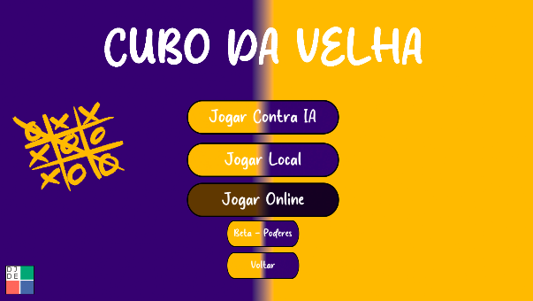
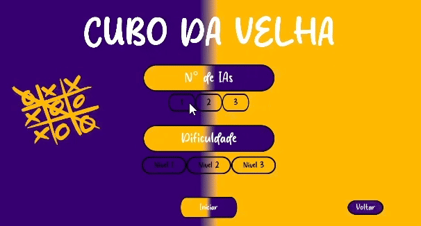
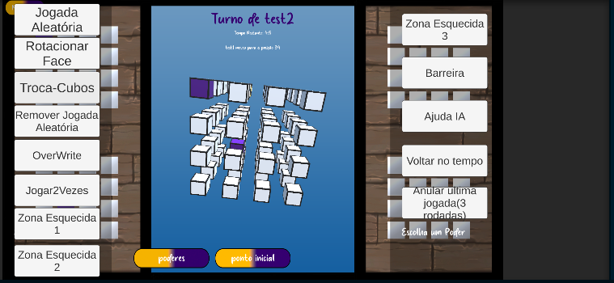
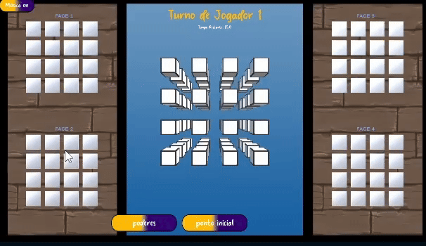

<!-- Optional title banner -->
<p align="center">
 
<p align="center">
  <a href="LICENSE"></a>
  
  
  
  
</p>

<h1 align="center">3D Tic-Tac-Toe (4×4×4) — Educational Game with Generative AI</h1>

<p align="center">
  <b>3D 4×4×4 game prototype created with the support of ChatGPT (GPT-4) to investigate prompting limits, human-AI co-authorship, and learning.</b><br/>
  <sub>Stack: Unity • C# • Git/GitHub
</p>

<p align="center">
  <a href="#-overview">Overview</a> •
  <a href="#-features">Features</a> •
  <a href="#-technical-stack">Technical Stack</a> •
  <a href="#-feature-list">Feature List</a> •
  <a href="#-controls">Controls</a> •
  <a href="#-methodology">Methodology</a> •
  <a href="#-challenges">Challenges</a> •
  <a href="#-results">Results</a> •
  <a href="#-Role">Role in the Project</a> •
  <a href="#-Credits">Credits</a> •
  <a href="#-Screenshots / Videos">Screenshots / Videos</a> 
</p>

---

## 🚀 Overview
This repository contains a **3D Tic-Tac-Toe (4×4×4)** game developed with the support of **generative AI**.  
**Original goal of the project:** to build the game **100% through ChatGPT**, in order to **explore the limits, capabilities, and best practices of prompting**, understanding where the AI succeeds, fails, and how to iterate toward a stable solution.  

The development used **ChatGPT (GPT-4)** as a collaborative programming agent, with minimal human intervention, and discusses its impact on **computational thinking** and **learning processes** (BNCC/TPACK).

> **Transparency:** whenever the AI produced incomplete or buggy code, the issues were **fixed by the human developer** and then **fed back into the AI**, documenting limitations and prompting lessons learned.

---

## ✨ Features
- 🎮 **Game modes:** human vs AI, local multiplayer (2–4 players); **online mode planned**.
- 🧠 **Enemy AI:** heuristic-based scoring for rows, columns, and diagonals in the 4×4×4 cube; *easy / normal / hard* difficulty levels.
- 🧭 **3D interaction:** cube orbit camera, **layer selection** for moves; **turn timer** (20s).
- 🧩 **UI:** AI count selection, **difficulty selection**, and **Reset** button to restore cube position.
- 🧪 **Educational research:** structured prompting methodology; analysis of human-AI interaction and learning outcomes.

---

## 🧱 Technical Stack
- **Engine:** Unity (2021.3.45f1)
- **Language:** C#
- **Generative AI:** ChatGPT (GPT-4)
- **Version Control:** Git/GitHub
- **Platforms:** Windows / Mac / Linux

---

## 📋 Feature List

| **Name** | **Description** |
|--------|----------------|
| Tic-Tac-Toe Gameplay | Classic Tic-Tac-Toe gameplay adapted to a grid, with win detection (horizontal, vertical, diagonal) and draw detection. |
| Game Modes | **Single Player (vs CPU)** and **Local Multiplayer (2 players)** with automatic turn switching (X/O). |
| Opponent AI | CPU using **optimal strategy (Minimax)** or **heuristic-based logic**, with **Easy / Medium / Hard** difficulty levels. |
| Win/Draw Detection | Instant validation after each move; **highlighting** of the winning sequence. |
| Controls & Accessibility | Mouse and keyboard (arrows / Enter / Esc); visible focus; prevents moves on occupied cells. |
| Quick Restart | **Restart** button to begin a new match, optionally keeping the scoreboard. |
| Match Scoreboard | Tracks X wins, O wins, and draws; displayed on the HUD. |
| Persistence (Optional) | **Save/load** scoreboard locally (e.g. JSON file) between sessions. |
| Turn Timer (Optional) | Configurable time limit per turn; timeout automatically switches turns. |
| UI Feedback | Sound and visual effects for moves, wins, and draws (toggleable). |
| Visual Themes | **Light/Dark** themes and customizable color palettes (high contrast). |
| Logs/Debug (Optional) | Simple console/log output for debugging AI and game states during development. |

---

## 🎮 Controls
| Action | Input |
|------|------|
| Orbit camera | Mouse |
| Select layer | Side UI |
| Confirm move | Click / UI Button |
| Reset camera | **Reset** Button |
| Turn timer | 20s |

---

## 🧭 Methodology
**Experiment setup:** the entire development cycle was conducted using **ChatGPT (GPT-4)** aiming to **generate 100% of the code and artifacts via AI**, with the human acting mainly in execution, logging, debugging, and design decisions.  
The focus was to understand **AI limitations** and **effective prompting strategies** (clarity, task decomposition, iteration, error feedback, and context resets).

**6-step prompting workflow**
1. (Optional) Clear previous context  
2. Assign a **role** (e.g. “senior C#/Unity programmer”)  
3. Clearly define **objectives and constraints**  
4. Request **clarifying questions** before solutions  
5. Require **step-by-step answers** (code + explanation)  
6. **Iterate** using logs, errors, and diffs until completion

---

## ⚠️ Challenges
- **AI-generated code errors or omissions** → solved using **detailed logs** and **focused prompts**  
- **Unity tooling and setup issues** → manual project and dependency adjustments  
- **Long context limitations** → tasks segmented and threads restarted when needed

---

## 📊 Results
- The AI **almost** completed the game on its own; **human intervention** was essential for heuristics, win validation, and UX polish  
- Students improved **C#**, **Unity**, **prompt engineering**, and **computational thinking**  
- Strong alignment with **BNCC/TPACK** and classic references (Papert, Piaget, Vygotsky)

---

## 👤 Role in the Project
- **Prompt engineering** (developed effective prompts, reviewed and adapted AI-generated code)  
- **Power-ups** (full implementation of all power mechanics)  
- **UI** (main menu and interface flow)  
- **Gameplay** (turn loop, move validation, win/draw detection)

---

## Credits (Team)

```
Fernando - Director
Marcos - Director
Priscila - Director
Valenco - Programmer & Prompt Engineering
Felipe - Programmer & Prompt Engineering
Arthur - Art & Audio
Gleice - Level Designer

```

---

## 📸 Screenshots / Videos
- **Menu**




-**PowerUp**





---


"# TicTacToe3D" 
